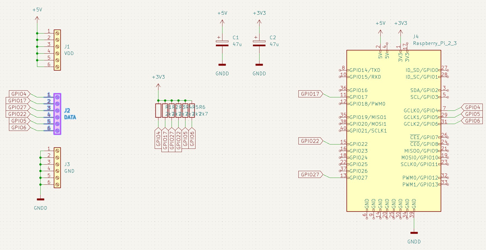
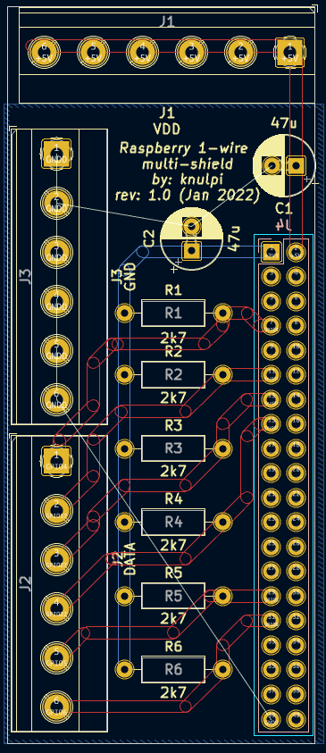

<h1 align="center">
1-wire multi-shield für Raspberry Pi
</h1>

> Verbinde bis zu sechs 1-wire Busse für viele Sensoren und Busnetze mit langen Leitung.

<div align="center">
    
</div>

_[🇬🇧 English version](README.md)_

In diesem Projekt geht es um einen einfachen Schaltkreis und das dazugehörige PCB.
Mit dem Board können bis zu sechs 1-wire Busnetze angebunden werden.
Damit können an die 60 Sensoren, wie DS18B20 Temperatursensoren, ausgelesen werden.
Jeder Pin der Datenschraubklemmen ist an einen GPIO des Raspberrys gekoppelt.
Durch den Steckverbinder kann das Board einfach auf die Pins des Raspberrys gesteckt werden.

## Motivation

Werden viele 1-wire Sensoren mit langen Leitungen ausgelesen, kommt es häufig zu Fehlern.
Manche Sensoren spucken falsche Werte aus oder werden gar nicht erst erkannt.
Indem man einzelne Sensoren in eigene Busse packt, kann man die Probleme deutlich verringern.

## Schaltplan

Der Schaltplan ist sehr simpel. Folgendes wird verbunden:
- die Masseklemmen mit einem Raspberry Massepin
- die VDD-Klemmen mit dem 5V Netz des Raspberrys
- jeder Pin der Datenklemmen mit einem spezifischen Pin am Raspberry
- die folgenden Pins am Raspberry werden genutzt
  - GPIO 4, 5, 6, 17, 22, 27

Da die GPIOs am Raspberry mit 3V3 arbeiten, sind die Pull-Up Widerstände auch mit dem 3V3 Netz des Raspberrys verbunden.
Die Pull-Ups sind in diesem Entwurf kleiner dimensioniert als standardmäßig empfohlen (4k7).
Das soll einen stabileren Betrieb mit langen Leitungen begünstigen.

Jedes der Speisnetze hat einen 47µF Kondensator zur Stabilisierung.



## PCB

Der Pinheader wird auf die Unterseite montiert (siehe Bilder).
So kann das Board direkt auf die Pins des Raspberrys gesteckt werden.

Jede Schraubklemme ist mit einem Netz verbunden.
Es gibt eine für Masse, eine für VDD (5V) und eine für die Datenleitungen.
Beim Abisolieren der Anschlussleitungen sollte etwas mehr Kabelreserve gehalten werden, um alle Schraubklemmen zu erreichen.



## Parts

Die Gerberdateien können direkt zum Bestellen des Boards verwendet werden.
Dies kann z.B. über [Aisler](https://aisler.net/p/NHLBOVQZ) geschehen.

Die folgenden Bauteile werden zusätzlich benötigt:
- 6x 2k7 Widerstände oder ähnlich
- 2x 47µF Kondensatoren oder ähnlich
- Schraubklemmen, Printklemmen mit 5.08mm Pinabstand für die Kabelverbindungen (z.B. 3x6-Pin-Blöcke oder 6x3-Pin-Blöcke etc.)
- Ein 20x2 Pin weiblicher header mit 2.54mm Pinabstand

## Software

> ⚠ Der laufende Kernel auf dem Pi darf nicht zu alt sein, um mehrere GPIOs für 1-wire gleichzeitig zu unterstützen.

Zum Einstellen des Pis wird für jeden verwendeten GPIO eine Zeile im `/boot/config.txt` eingetragen.
Sollte die Vorgehensweise unklar sein, empfehle ich ein Tutorial zu suchen, wie zum Beispiel [dieses](https://blog.oddbit.com/post/2018-03-27-multiple-1-wire-buses-on-the/).

Am Ende sollten in der `/boot/config.txt` folgende Zeilen enthalten sein:
```
dtoverlay=w1-gpio,gpiopin=4
dtoverlay=w1-gpio,gpiopin=5
dtoverlay=w1-gpio,gpiopin=6
dtoverlay=w1-gpio,gpiopin=17
dtoverlay=w1-gpio,gpiopin=22
dtoverlay=w1-gpio,gpiopin=27
```

Nach einem Neustart sollten die angeschlossenen Sensoren in `/sys/bus/w1/devices` erscheinen.
Das weitere Vorgehen erfolgt dann analog zum Betrieb von nur einem Sensor.

## Empfehlungen
- geschirmte Leitungen sollten bei langen Strecken dringend verwendet werden
- kleinere Widerstandswerte (zB 1k5) können bei vielen angeschlossenen Sensoren helfen

## Verbesserungsvorschläge

Gerne einfach Pull Request öffnen oder ein Issue erstellen für Verbesserungsvorschläge oder fehlende Dinge.
