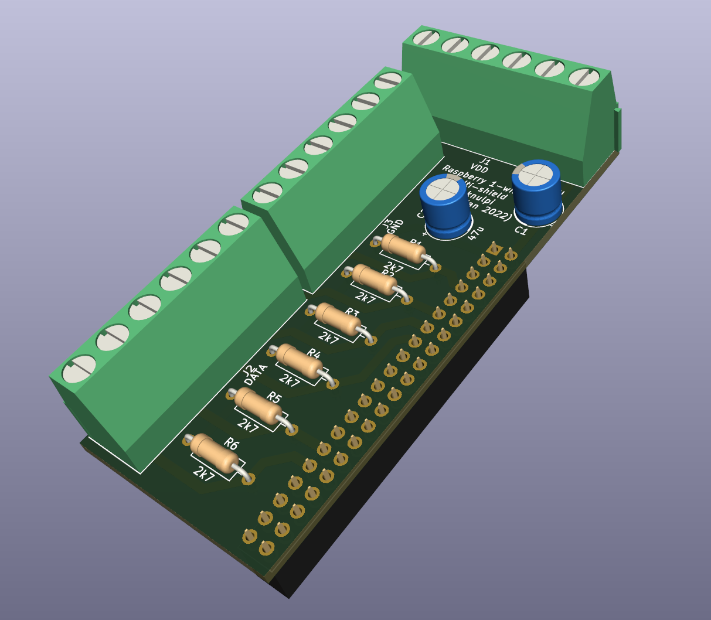

<h1 align="center">
1-wire multi-shield for Raspberry Pi
</h1>

> Use up to six 1-wire bus lines to connect multiple sensors on long lines.

<div align="center">
    
</div>

This is a project providing a circuit and PCB design for a Raspberry Pi shield. 
The board can connect up to six 1-wire busses, enabling to connect up to around 60 sensors, like DS18B20.
Each data pin of the terminals is wired to one specific GPIO.
The board can easily be plugged onto a Raspberry Pi.

## Motivation

Connecting 1-wire sensors with long lines is error-prone and will not work with many sensors.
You may get random disappearing sensors or bad value readings.
Splitting problematic sensor lines into own busses greatly reduces these inabilities.


## Circuit

The circuit is quite simple. It basically connects 
- the GND terminals with a Raspberry GND pin
- the VDD terminals with the Raspberry's 5V net
- each Data terminal pin with an own GPIO
- used data pins are
  - GPIO 4, 5, 6, 17, 22, 27

Since the Raspberry's data pins operate at 3V3, the pull-up resistors for the data lines are using
the 3V3 net of the Raspberry.
The pull-ups are lower than the default recommended value (4k7). 
This should stabilize long bus lines.

Each power net has a 47uF capacitor for stabilization.


## PCB

The PCB follows the schematic. 
The pin-header is mounted on the bottom side of the board (see images).
This enables the board to be connected directly with the Raspberry pin headers.

Each screw terminal is connected to one net. There is one for GND, one for VDD and one for DATA.
Be aware that you might reduce more insulation of your cables to reach all terminals.


## Parts

The gerber files can be used to direcly order the board, e.g. via [Aisler](https://aisler.net/p/NHLBOVQZ).

The following parts are needed:
- 6x 2k7 resistors or similar
- 2x 47µF capacitors or similar
- Pitch Screw Terminal Blocks with a 5.08mm pin distance to connect 3x6 wires (e.g. 3x6-pin-blocks or 6x3-pin-blocks etc.)
- A 20x2 pin female header with a 2.54mm pin distance

## Software

> ⚠ Your kernel must not be too old, so that it supports multiple 1-wire enabled GPIOs 

To set up your Pi, enable each GPIO used for 1-wire protocol in your `/boot/config.txt`. 
Every GPIO we connected will have its own line. 
If you are unsure what to do, follow other tutorials in the web that describe the procedure in detail, 
like [this tutorial](https://blog.oddbit.com/post/2018-03-27-multiple-1-wire-buses-on-the/).

In the end, your `/boot/config.txt` file should contain these lines:
```
dtoverlay=w1-gpio,gpiopin=4
dtoverlay=w1-gpio,gpiopin=5
dtoverlay=w1-gpio,gpiopin=6
dtoverlay=w1-gpio,gpiopin=17
dtoverlay=w1-gpio,gpiopin=22
dtoverlay=w1-gpio,gpiopin=27
```

Restart and your sensors will appear in `/sys/bus/w1/devices`.

## General recommendations
- use shielded wires on long connections
- lower the resistor to something like 1k5 if you are getting problems with many sensors

## Contributing

Feel free to open Pull Requests or just create issues if you feel that something is missing or can be improved.
